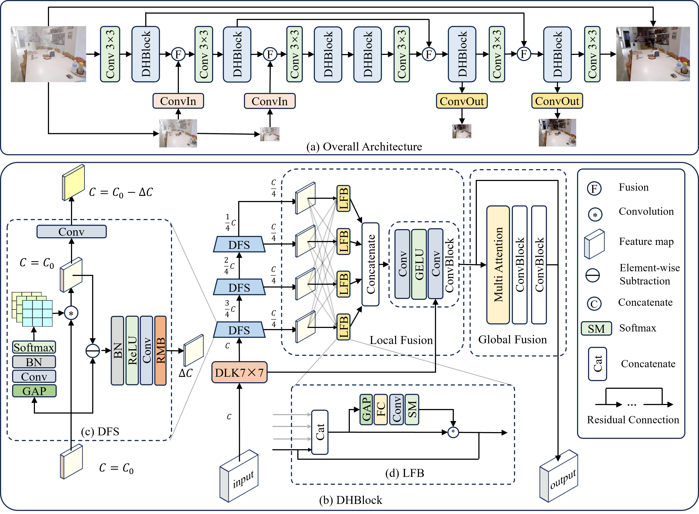

# DHFSN: Dynamic Hierarchical Feature Selection Network for Single Image Dehazing

This repository contains the official implementation of the paper "DHFSN: Dynamic Hierarchical Feature Selection Network for Single Image Dehazing" published in **Pattern Recognition**.

## Model Architecture

<p align="center">
  
</p>

## Installation

### Prerequisites

- Python 3.7+
- PyTorch 1.9.0+
- CUDA 11.0+

### Install Dependencies

```bash
pip install -r requirements.txt
```

## Pretrained Models

| Dataset | Download |
|---------|----------|
| ITS | [Google Drive](https://drive.google.com/file/d/1dy2essrSeJT_o7ZKayhsnEymaMRpNyM0/view?usp=drive_link) |

Download the pretrained model and place it under `pretrained_models/`.

## Datasets

We evaluate our method on both synthetic and real-world datasets:

- **ITS** (RESIDE): Indoor Training Set
- **Haze4K**: Synthetic hazy dataset
- **Foggy Cityscapes**: Fog-enhanced Cityscapes
- **DenseHaze**: Real-world dense haze
- **NH-HAZE**: Real-world non-homogeneous haze
- **O-HAZE**: Real-world outdoor haze

### Dataset Structure

```
dataset_root/
├── train/
│   ├── hazy/          # Hazy images
│   └── clear/         # Clear/Ground truth images
└── test/
    ├── hazy/          # Hazy images for testing
    └── clear/         # Clear/Ground truth images for testing
```

### Label Naming Conventions

| Dataset | Hazy Image | Ground Truth |
|---------|------------|--------------|
| ITS | `{id}_{id2}_{beta}.png` | `{id}.png` |
| Haze4K | `{id}_{id2}_{beta}.png` | `{id}.png` |
| DenseHaze | `{id}_hazy.png` | `{id}_GT.png` |
| NH-HAZE | `{id}_hazy.png` | `{id}_GT.png` |
| O-HAZE | `{id}_outdoor_hazy.png` | `{id}_outdoor_GT.jpg` |
| Foggy Cityscapes | `{city}/{id}_foggy_beta_{beta}.png` | `{city}/{id}.png` |

## Usage

### Training

```bash
# Train on ITS dataset
python main.py --mode train --dataset ITS --data_dir ../ITS_v2

# Train on DenseHaze dataset
python main.py --mode train --dataset DenseHaze --data_dir ../DenseHaze

# Train on O-HAZE dataset
python main.py --mode train --dataset O-HAZE --data_dir ../O-HAZE

# Train on NH-HAZE dataset
python main.py --mode train --dataset NH-HAZE --data_dir ../NH-HAZE

# Train on Haze4K dataset
python main.py --mode train --dataset Haze4K --data_dir ../Haze4K

# Train on Foggy Cityscapes dataset
python main.py --mode train --dataset FoggyCityscapes --data_dir ../FoggyCityscapes
```

### Testing

```bash
# Test on ITS dataset
python main.py --mode test --dataset ITS --data_dir ../ITS_v2 --test_model results/Best.pkl

# Test with saving output images
python main.py --mode test --dataset ITS --data_dir ../ITS_v2 --test_model results/Best.pkl --save_image True
```

### Custom Training Parameters

```bash
python main.py --mode train --dataset ITS --data_dir ../ITS_v2 \
    --batch_size 8 \
    --learning_rate 4e-4 \
    --num_epoch 1500 \
    --save_freq 100 \
    --valid_freq 10
```

### Single Image Dehazing

```bash
python example.py --input hazy_image.png --output dehazed.png --model results/Best.pkl
```

## Default Training Configuration

| Dataset | Learning Rate | Batch Size | Epochs | Save Frequency |
|---------|---------------|------------|--------|----------------|
| ITS | 1e-4 | 5 | 100 | 1000 |
| Haze4K | 4e-4 | 8 | 1500 | 100 |
| DenseHaze | 2e-4 | 2 | 5000 | 100 |
| NH-HAZE | 2e-4 | 2 | 5000 | 1000 |
| O-HAZE | 2e-4 | 2 | 5000 | 100 |
| Foggy Cityscapes | 4e-4 | 2 | 200 | 10 |

## License

This project is licensed under the MIT License - see the [LICENSE](LICENSE) file for details.
